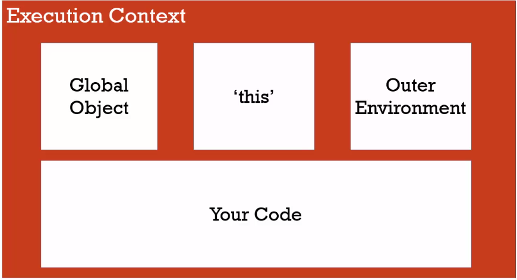
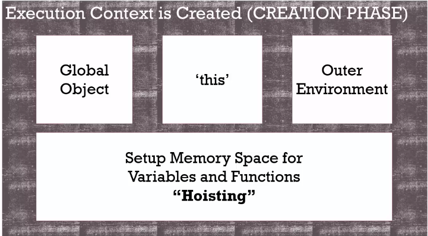
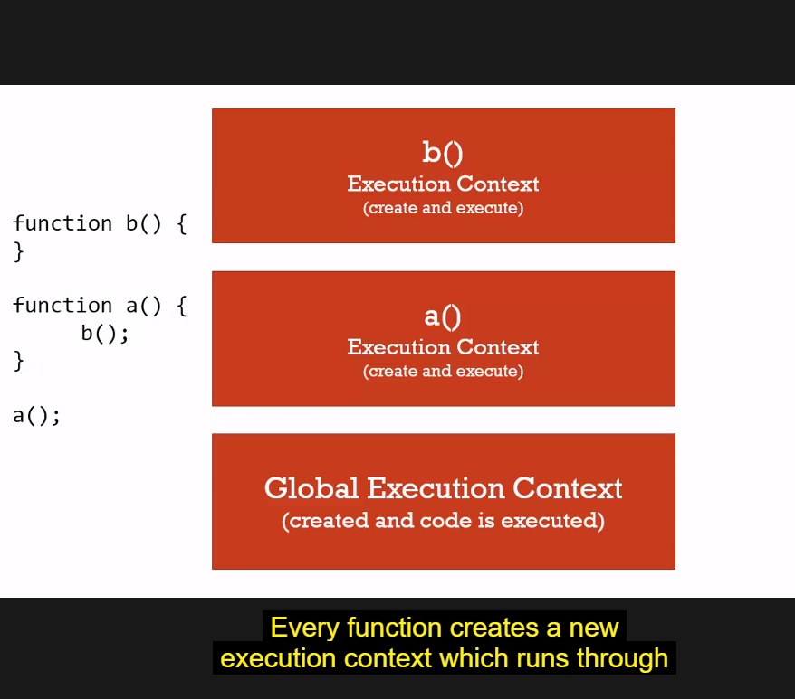
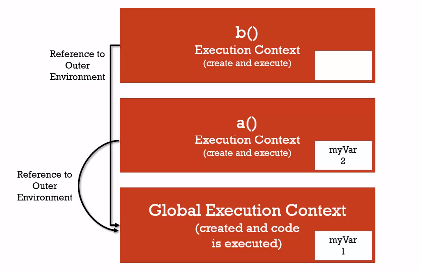
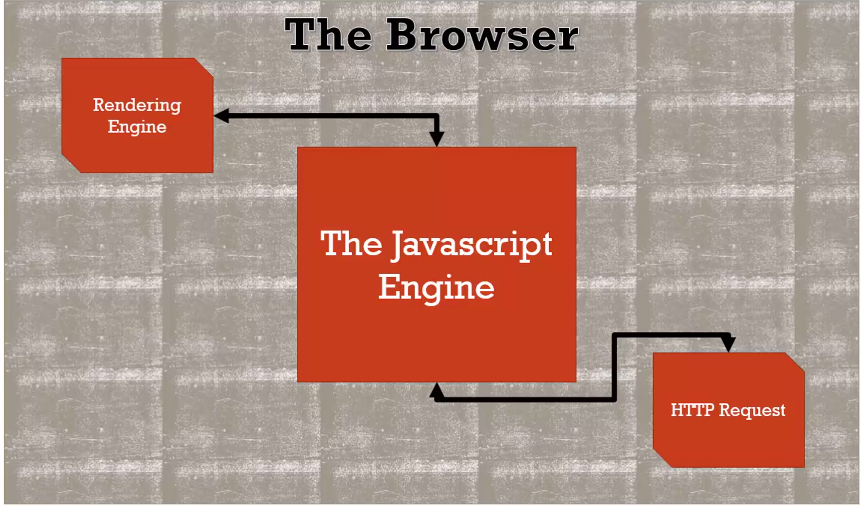
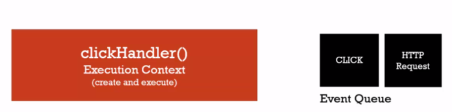

## JavaScript: The weird parts

This repository will contain JavaScript snippets and lessons learned through my studying hiatus.

**What is a key/value pair?**

```javascript
var name = 'leo';
```

**What is a object?**

```javascript
var person = {
    firstName: 'ed',
    superpowers:  ['eat', 'sleep', 'code']
};
```

### Vocabulary
```
Syntax Parser
```
> A program that reads your code and determines what it does and if its grammar is valid.

> *Gist - code written is not magic. Someone wrote software for the PC to understand.*

```
Lexical Environment
```
> Where something sits physically in the code you write.

```
Execution Context
```
> A wrapper to help manage the code that is running.



```
Global Object
```
> Anything that is not inside a function.

```
Hoisting
```
> When functions and variables get allocated to memory. Functions are set in there entirety while the variables value are set to 'undefined'.

```javascript
b(); // => 'Called b!'
console.log(a); // => 'undefined'
var a = 'Hello there';
function b() {
    console.log('Called b!');
}
```


```
Global Object
```
>> Anything that is not inside a function.

> **Pro Tip**: Never set a variable to *undefined*, let javascript engine do its thing.

```
Single Threaded
```
> One command is executed at a time.

```
Synchronous
```
> One command is executed at a time and in order.

```
Invocation
```
> Running a function

```
foo()
````

> Everything a function is called, a new execution context is created for that function.



```
Variable Enviroment
```

> Where the *variable* lives and how they relate to each other in memory.


```
Scope
```

> Where a variable is available in your code and if its truly the same variable or a new copy.

> **Pro Tip**: Every execution context has a reference to its outer enviroment and that is how *scope* works in javascript.



With the introduction of ES6 you can use *let*, which allows the javascript engine to use whats called block scoping

```javascript
if ( a > b ) {
  let c = true; // => You wont be able to use 'c' until the line of code is runned. if you tried to use it before, you will get an error.
}
```

```
Asynchronous
```

> More than one at a time. But the asynchronous part is really about what happening outside the javascript engine.



> When the queue is empty, javascript periodically looks at the event queue



> **Pro Tip**: The event queue wont be processed *until* the execution stack is empty. Until javascript is finished running all of that other code line by line. So it really isn't asynchronous.

> What's happening is the browser asynchronously is putting things into the event queue.
