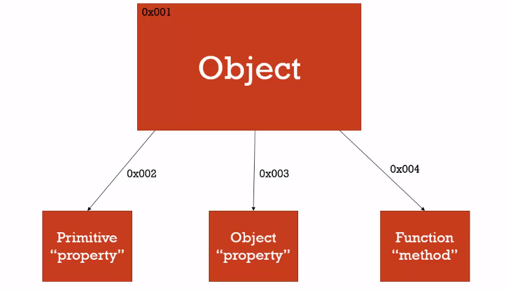
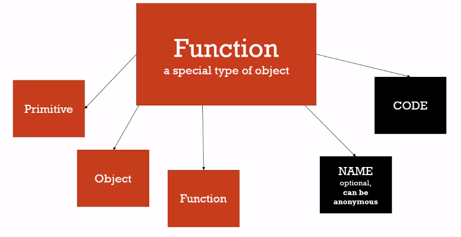
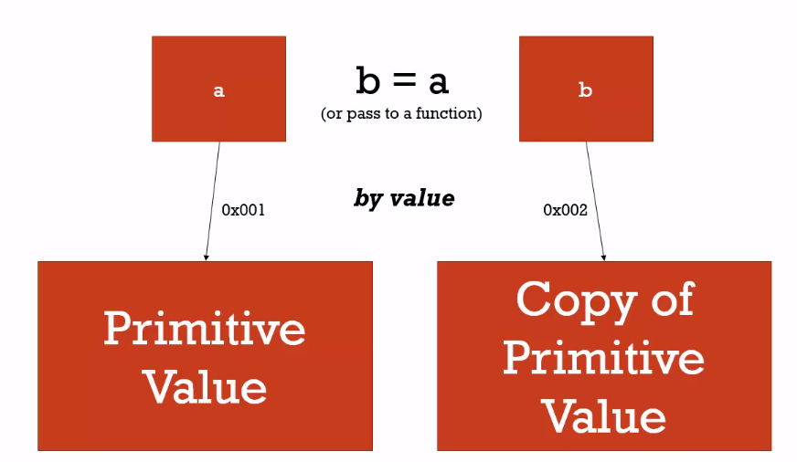
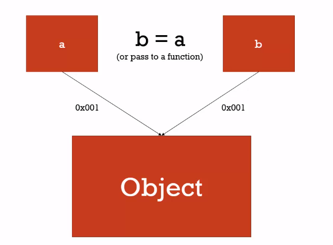

## JavaScript: The weird parts

This repository will contain JavaScript snippets and lessons learned through my studying hiatus.

**What is a key/value pair?**

```javascript
var name = 'leo';
```

**What is a object?**

```javascript
var person = {
    firstName: 'ed',
    superpowers:  ['eat', 'sleep', 'code']
};
```

> Objects have references to all the properties and methods its connected to.


### Vocabulary
```
Syntax Parser
```
> A program that reads your code and determines what it does and if its grammar is valid.

> *Gist - code written is not magic. Someone wrote software for the PC to understand.*

```
Lexical Environment
```
> Where something sits physically in the code you write.

```
Execution Context
```
> A wrapper to help manage the code that is running.


```
Global Object
```
> Anything that is not inside a function.

```
Hoisting
```
> When functions and variables get allocated to memory. Functions are set in there entirety while the variables value are set to 'undefined'.

```javascript
b(); // => 'Called b!'
console.log(a); // => 'undefined'
var a = 'Hello there';
function b() {
    console.log('Called b!');
}
```


```
Global Object
```
>> Anything that is not inside a function.

> **Pro Tip**: Never set a variable to *undefined*, let javascript engine do its thing.

```
Single Threaded
```
> One command is executed at a time.

```
Synchronous
```
> One command is executed at a time and in order.

```
Invocation
```
> Running a function

```
foo()
```

> Everything a function is called, a new execution context is created for that function.


```
Variable Enviroment
```

> Where the *variable* lives and how they relate to each other in memory.


```
Scope
```

> Where a variable is available in your code and if its truly the same variable or a new copy.

> **Pro Tip**: Every execution context has a reference to its outer enviroment and that is how *scope* works in javascript.


With the introduction of ES6 you can use *let*, which allows the javascript engine to use whats called block scoping

```javascript
if ( a > b ) {
  let c = true; // => You wont be able to use 'c' until the line of code is runned. if you tried to use it before, you will get an error.
}
```

```
Asynchronous
```

> More than one at a time. But the asynchronous part is really about what happening outside the javascript engine.


> When the queue is empty, javascript periodically looks at the event queue


> **Pro Tip**: The event queue wont be processed *until* the execution stack is empty. Until javascript is finished running all of that other code line by line. So it really isn't asynchronous.

> What's happening is the browser asynchronously is putting things into the event queue.

```
Dynamic Typing
```

> In javascript you don't tell the engine what type of data a variable holds, it figures it out while your code running

```
Static Typing
```

> In java however static typing is used and it will freak out if you give a variable that does not match the data type.

```java
bool isThere = 'hello' // => ERROR
```

```
Primitive Type
```

> A type of data that represents a single value and that is not an object.
> There are 6 types of primitive data:

```
undefined
null
boolean
number
string
symbol
```

```
Operator
```

> A special function that is syntactically (written) differently. Generally operators take two parameters and return one result.

```
Operator Precedence
```

> Which operator function gets called first. Higher precedence wins.

```
Associativity
```

> What order operator functions get called in: **left-to-right** or **right-to-left**. When functions have the same precedence.

[reference](https://developer.mozilla.org/en-US/docs/Web/JavaScript/Reference/Operators/Operator_Precedence)

```
Coercion
```

> Converting a value from one type to another.

```javascript
var a = 1 + '2';
console.log(a);   //=> '12' javascript coerced the values together.

// Another Example

console.log(3 < 2 < 1); //=> true
// < - left to right associativity.
// (3 < 2 < 1) ==> (false < 1)
// Then javascript coerced false; Example:
Number('3'); //=> 3
Number(false); // => 0
// (false < 1) ==> (0 < 1) ==> true
```

**Pro Tip**: Use '===' equality in your code, because it wont try to coerce the values. Thus you wont get an unexpected surprise.

```
Namespace
```

> A container for variables and functions. Typically to keep variables and functions with the *same* name separate.

```javascript
// Same function name but not the same because there in a different container.
var english  = { greet: 'hello' };
var spanish  = { greet: 'hola'  };
```


> JSON and object literals are not the same. JSON is stricter in the sense that needs to written in a certain way.



```
First Class Functions
```

> Everything you can do with other types you can do with functions. Assign them to variables, pass them around, create them on the fly.

```
Expression
```

> Unit of code that results in a value. It doesn't have to save to a variable.
```javascript
var a;
a = 3; //=> 3
1+2;   //=> 3
```

> Function expressions are **not** hoisted.

```javascript
greet(); //=> undefined is not a function
var greet = function() {
    console.log('hi');
}
```

```
Mutate
```

> To change something.

```
Immutable
```

> Can't be changed.

```
Value vs Reference
```




```
Arguments
```

> The paramaters you pass to a function

```
White Space
```

> Invisiable characters that create literal 'space' in your written code. Example: space, tabs, returns
